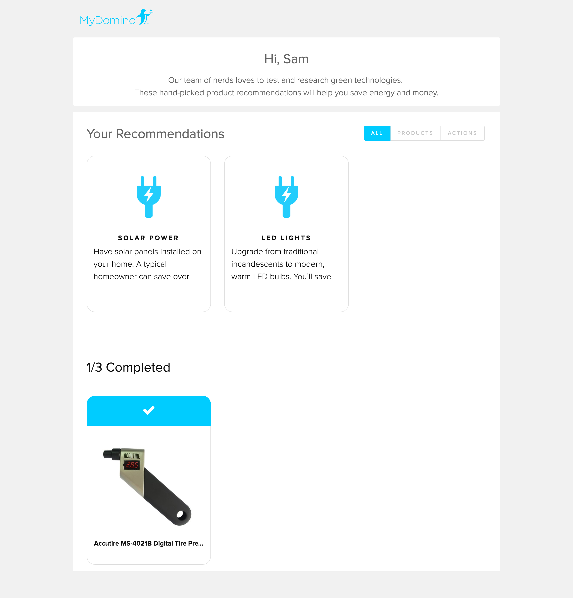
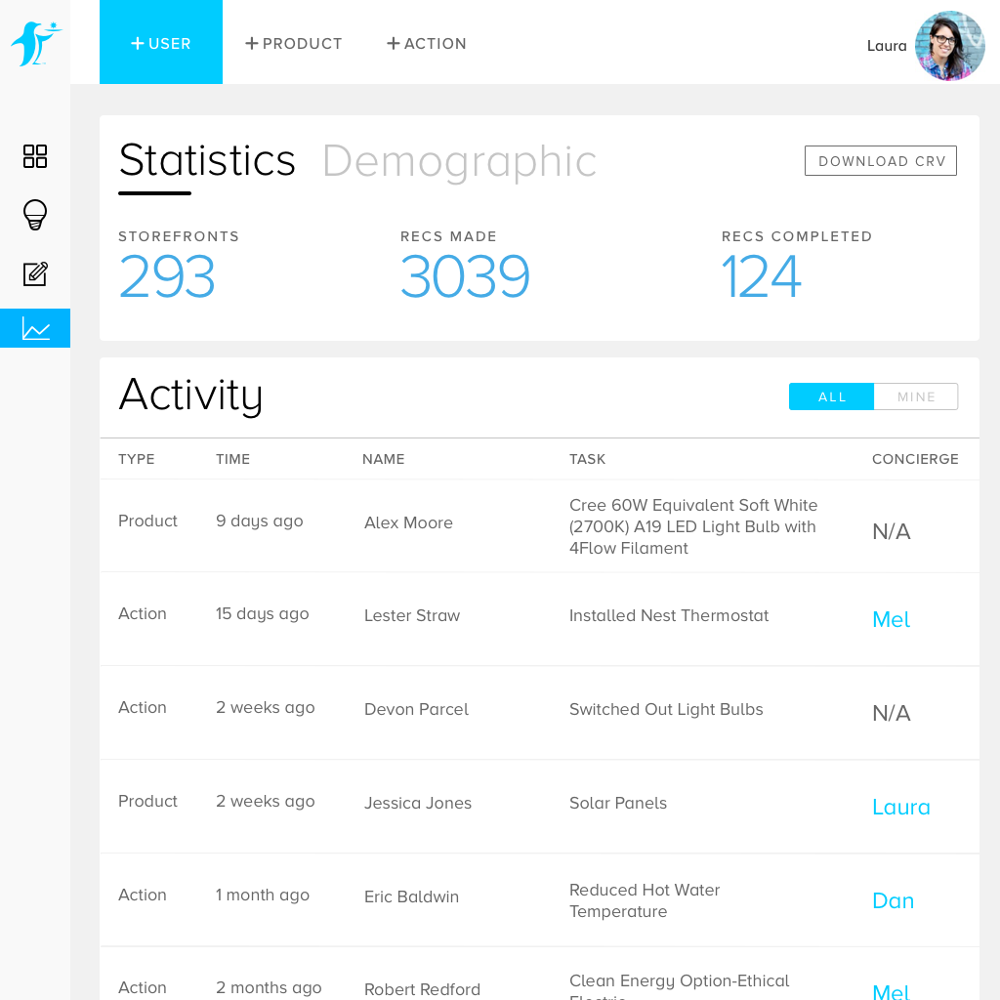

## Building a better way to manage homeowners' path towards clean energy

<h4>Skills Applied</h4>
<ul class="list-reset h3 mt0">
<li>Visual Design</li>
<li>Product Design</li>
</ul>

  <h4>Team</h4>
  <h3 class="mt0 h3 regular"><a href="http://github.com/jcmorrow" target="_blank" class="link">Josh Morrow</a></h3>
  <h3 class="mt0 h3 regular">Eva</h3>
  <h3 class="mt0 h3 regular">Rosana</h3>

## About
Domino is a committed to helping people contribute to a more sustainable planet.
Concierges assess homeowners utility habits and recommend clean energy products that can help them save money.

## Problem

After a concierge makes the recommendations, it’s extremely difficult to help homeowners achieve those recommendations. How would homeowners communicate that they’ve completed recommendations? How would concierges help homeowners succeed in switching to renewable energy.

## Concept

We decided to build a dashboard that would allow users to revisit their recommendations and check off recommendations they’ve completed. On the surface, the dashboard helps homeowners visualize their progress. On the other side, the dashboard also helps concierges become more efficient in managing homeowner activity.

### Iteration 1

**v0.** --- The design began with a simple Amazon iframe on a webpage. As I researched more into Amazon iframe, it actually offered very limited capabilities.

**v1.** --- I decided that we would leverage the Amazon API to build our own product database. This would offer a heftier service while providing a consistent brand experience. The first iteration of the dashboard is shown below:

I conducted unmoderated user interviews to gain insight on how our users were using our new product. 2 common pain points came up:

1. It took users a lot of time to understand that there was a "Product" section at the bottom
2. The affordance that things can be completed wasn't immediately noticeable

*Note: These findings weren't particularly unexpected. At the time, stakeholders felt there were higher priorities. Our team leveraged user testing to support the argument that this product needed more refinement to be assessed for value*

### Exploring the 2nd Iteration
 

### Shipped Design
Instead of bucketing the items by type, we decided to group them by completion. By relying on binary relationship, users would have an easier time remembering one over the other. The items also now have hover states to better indicate that they're interactive.

## We didn't forget you, concierges!

Designing the concierge side was a lot quicker due to the immediate access to feedback. I made a small interaction flow for our engineer to build the back-end while I worked on the front-end design.

### Using Basscss

When beginning to build the front-end, I noticed a lot of legacy code that was getting lost in our stack. I made an argument to our engineer to switch to using Basscss as I build out our <a href="https://dribbble.com/shots/2549235-MyDomino-Design-System-1a" target="_blank" class="link">design system</a>. At first, I was faced with skeptism, but Basscss was not only  easily readable, but also extremely quick to build with.

### Concierge-Side
 

