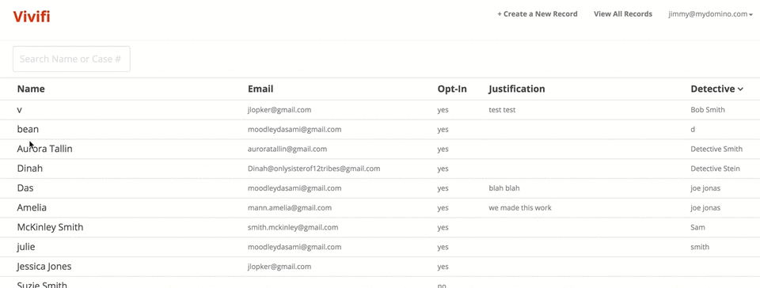

# Designing a more effective system for sexual assault case management

<h4>Skills Applied</h4>
<ul class="list-reset h3 mt0">
<li>CSS</li>
<li>Front-End Design</li>
</ul>

  <h4>Time</h4>
  <h3 class="mt0 h3 regular">1 Weekend</h3>

  <h4>Team</h4>
  <h3 class="mt0 h3 regular"><a href="http://twitter.com/@dasmoods" target="_blank" class="link">Dasami Moodley</a></h3>
  <h3 class="mt0 h3 regular"><a href="http://twitter.com/@rizwanreza" target="_blank" class="link">Rizwan Reza</a></h3>
  <h3 class="mt0 h3 regular"><a href="http://twitter.com/@ameliocracy" target="_blank" class="link">Amelia Gilbert</a></h3>
  <h3 class="mt0 h3 regular"><a href="http://twitter.com/@mckinleysmith" target="_blank" class="link">McKinley Smith</a></h3>

## Problem

The process of putting together a sexual assault case currently fails the purposes of advocating for victims and bringing perpetrators to hand. This problem can be improved by building a better intake and management system. Here’s an overview of the current situation:

  1. To initiate the case, the SANE (Sexual Assault Nurse Examiner) Nurse examines the victim. The results of the examination are sealed inside of a Sexual Assault Kit (SAK).
  2. The SAK goes through a process of medical examination. The findings are meant to support the identification of perpetrator(s) and to provide evidence for a potential trial.
  3. After the SAK gets processed, an investigator is assigned to pursue the case.
  4. The investigator finds the perpetrator, brings them to trial, and concludes the case.

Sounds great, right? However, the reality is that investigators rarely get the necessary information to proceed with the case. There is always a large backlog of SAK that might never see an investigator.

In one weekend, my team and I sought to address this bottleneck by building a Minimum Viable Product (MVP) for product validation.

## Sketching

I communicated the design through sketching first. This enables us to quickly draw out potential solutions while keeping design overhead low.

We were also able to quickly throw out inferior solutions as well. This pop-up solution increased the complexity of the product and expensive for engineering.

## Solution

We determined that the biggest problem was how information was being distributed between professionals. Our proposed management system is aimed toward bridging the gaps between people and making the process as efficient as possible.

### Creating a record

SANE Nurses initiate cases, but they have legal limitations on their access of information:

- They cannot edit the cases after it has been submitted

- They cannot view other cases

To account for these limitations, we decided to separate "SANE Nurse" and "Investigator" types where SANE Nurses can only create new records and Investigators can create and view records.

Because SANE Nurses can only create new records, we have a “Review” button to help them confirm that they've entered the information accurately.

### Investigating a case
After a case has been submitted, the case shows up on the dashboard (which only the investigator may see). The investigator can then proceed to look through each case and fill out the information they’ve collected. 

Once an investigator presses “Complete,” an automated email message is sent to the victim to update them on the progress of their case.

## Conclusion
We built this project during a snowy weekend near Lake Tahoe, so it’s definitely a small application. Still, we solved our scope of the problem (increasing transparency of information) and even squeezed in a nifty feature (email updates).

## Next Steps

With an MVP built out, we're beginning to do some product validation with small counties in the Midwest. We're also planning on starting a Kickstarter campaign so there will be second version coming out soon.

## 3 Lessons Learned

### 1. Designing in the Browser Reduces Engineering Cost

I used a [Tachyons spacing module](http://tachyons.io/) on top of a [Bootstrap theme](https://bootswatch.com/paper/) in which Tachyons' atomic classes really showed big gains without conflicting the Bootstrap CSS (It's amazing what margin and padding can do alone). At first, I was unused to using a application outside of Sketch, but I soon found out that I was building things faster than I would have in Sketch. It’s amazing what margin and padding can do alone. From this, I learned how utility classes can enable designers to contribute on production code. Relieving engineers from coding pixel-perfect designs is a huge win in
my book.

### 2. UX Freebies from MEAN Stack Ultimately Helps Our Users

We ultimately chose MEAN stack, but we had disagreements about choosing MEAN over Rails. Although I was more familiar with Ruby on Rails, I now understand why we chose MEAN. Take a look at this interaction:

This search input allows us to remove having an "Enter" button, which mean users can get to what they want faster and it comes for free!

Because MEAN processes most of its information on the client side, we can minimize clicks to help users achieve their goals easier. With our heavy focus on input fields, choosing MEAN enabled us to make a simpler application with less friction for the user.

### 3. User Stories Guide Our Scope

A significant obstacle in hack projects is deciding what can be reasonably built in 1-2 days. By engaging user stories in the ideation and planning phases, we were able to organize and complete features efficiently while keeping a holistic view of the project’s scope.

For example, a user story we really wanted was for victims to engage with the investigator on the progress of their case. This user story came up multiple times in conversation, but other user stories proved to have higher priority. Building out a "victim dashboard" would require the same amount of time. Also, the product wouldn't be able to exist if investigators had no information to pursue cases.

